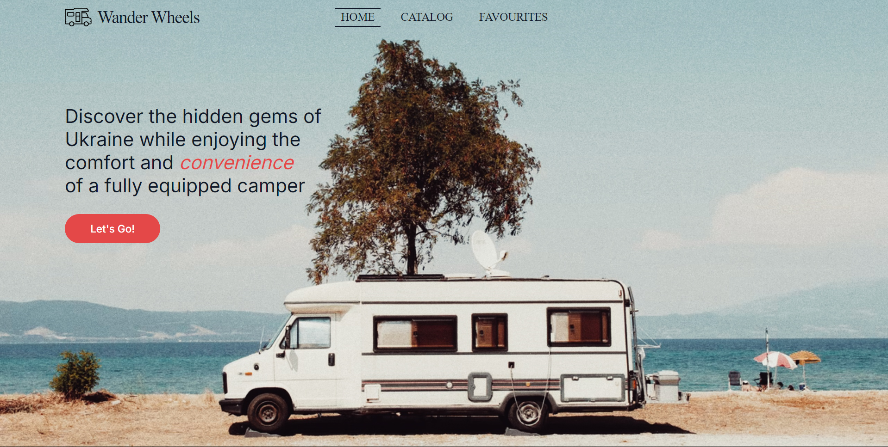

  
  <h1 style="margin: 0 16px;  border: none; color: #101828; font: 30px Raleway;">Wander Wheels</h1>
  

<!-- 
 -->

<video width="600" controls>
  <source src="./public/video.mp4" type="video/mp4">
</video>

<h2 style="text-align: center; color: #E2E2E0; font: 30px Raleway;">How to use</h2>
